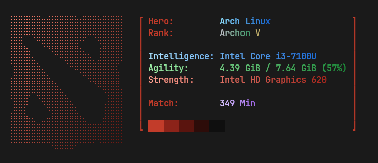

# Dota 2 fastfetch theme

A [fastfetch](https://github.com/fastfetch-cli/fastfetch) config styled like a Dota 2 hero card.



- Dota 2 logo in braille art with a light → dark red diagonal gradient
- System info as hero stats: **Intelligence** = CPU, **Agility** = RAM, **Strength** = GPU, **Match** = uptime in minutes
- Attribute lines coloured like in the game (blue / green / red), rank in the colours of its medal
- The whole block wrapped in big red brackets
- Works on any Linux PC: CPU/GPU are detected by fastfetch (Intel, AMD, NVIDIA; the discrete GPU is preferred on laptops), the **Hero** colour follows your distro (Arch, Ubuntu, Debian, Fedora, Mint, Manjaro, openSUSE, EndeavourOS, Pop!_OS, CachyOS, NixOS, Gentoo; others get white → grey)

## Requirements

- fastfetch 2.x
- A terminal with truecolor support (kitty, alacritty, foot, wezterm…)
- A font with braille characters (any Nerd Font works)
- Linux (`/proc` is used for RAM and uptime)

## Install

```bash
git clone https://github.com/sakurasso12/dota2-fastfetch.git
cd dota2-fastfetch
./install.sh
fastfetch
```

Your old `~/.config/fastfetch/config.jsonc` is backed up automatically.

To show it every time you open a terminal, add this to `~/.bashrc` (or `~/.zshrc`):

```bash
command -v fastfetch >/dev/null && fastfetch
```

## Set your rank

Open `~/.config/fastfetch/dota.sh` and change the two lines at the top:

```bash
RANK_MEDAL="Archon"   # Herald, Guardian, Crusader, Archon, Legend, Ancient, Divine, Immortal
RANK_STARS="V"        # I-V, or "" for none
```

The rank is drawn in the colours of its medal.

## Customize

All text and colours live in `~/.config/fastfetch/dota.sh`:

- colours: `INT_GRAD`, `AGI_GRAD`, `STR_GRAD` are `R G B` (light) → `R G B` (dark)
- the `gradient TEXT R1 G1 B1 R2 G2 B2` helper colours any text letter by letter

`ascii/dota2.txt` is the plain logo; `ascii/dota2-gradient.txt` is the same logo with the colour gradient baked in.

## How it works

fastfetch cannot pad module output to a fixed width, so the right bracket would not line up.
Each info line is therefore produced by `dota.sh <line>`, which measures the longest line and pads
every line to that width. CPU and GPU names are read once with fastfetch (`dota-hw.jsonc`) and cached
in `~/.cache/dota-fastfetch/hw` for a day; RAM and uptime are read live from `/proc`.

## License

[MIT](LICENSE). Dota 2 is a trademark of Valve Corporation; this is a fan-made theme and is not affiliated with Valve.
